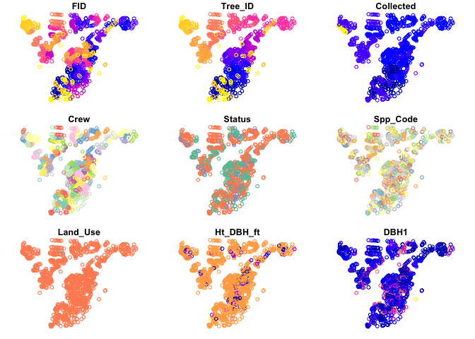
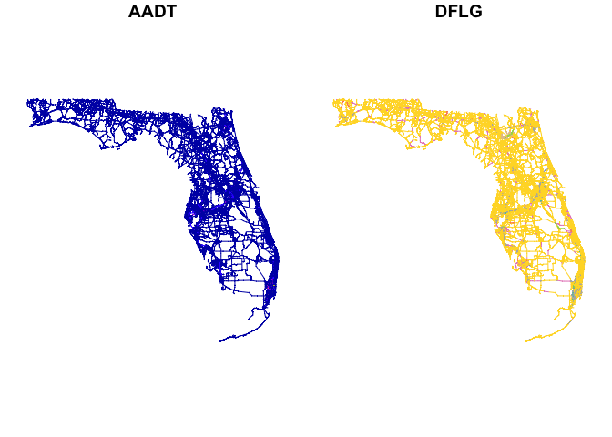
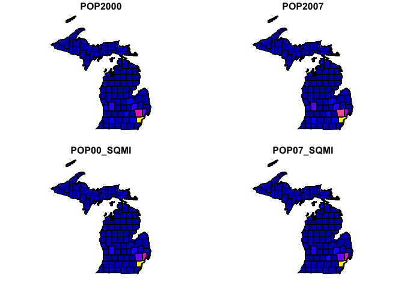

<!-- README.md is generated from README.Rmd. Please edit that file -->

# esri2sf

<!-- badges: start -->

[](https://CRAN.R-project.org/package=esri2sf)
[](https://www.repostatus.org/#active)
[](https://opensource.org/licenses/MIT)

<!-- badges: end -->

Download ArcGIS FeatureServer and MapServer Data to Simple Features

The [ArcGIS
FeatureServer](https://enterprise.arcgis.com/en/server/latest/publish-services/windows/what-is-a-feature-service-.htm)
or
[MapServer](https://enterprise.arcgis.com/en/server/latest/publish-services/windows/what-is-a-map-service.htm)
services are among the most common sources for geospatial data. The
esri2sf package enables users to download data from an ArcGIS Server to
a simple feature (sf) or data frame object using the [ArcGIS REST
API](https://developers.arcgis.com/rest/). You can learn more about
[working with sf
objects](https://r-spatial.github.io/sf/articles/sf1.html) in the
documentation for the [sf package](https://r-spatial.github.io/sf/).

## How esri2sf works

This package takes the layer URL and query (created from a bounding box,
geometry, and other parameters). Typically, the ArcGIS REST API limits
the maximum number of rows that can be returned from a single query.
This package uses [httr2](https://httr2.r-lib.org/) to query the server
and initially returns the ID for all features and then batches the IDs
to return all requested features from the server.

The geometry is returned as a [FeatureSet
object](https://developers.arcgis.com/documentation/common-data-types/featureset-object.htm)
(also known as an ESRI JSON object). The JSON is converted into an sf
object and combined with the attribute data to return an sf data frame.

## Install

Use [pak](https://pak.r-lib.org/) to install this fork of the esri2sf
package from GitHub:

``` r
pak::pkg_install("elipousson/esri2sf")
```

## How to use esri2sf

To use esri2sf, you need is the URL of a FeatureServer or MapServer
layer you want to download. You can get the URL by viewing the URL
widget on the service’s webpage (see image below), by asking a GIS
admin, or looking at the code of a webpage where it creates a feature
layer.


You can then use the url with esri2sf to download data:

``` r
library(esri2sf)
url <- "https://services.arcgis.com/V6ZHFr6zdgNZuVG0/arcgis/rest/services/Landscape_Trees/FeatureServer/0"

df <- esri2sf(url)
#> ── Downloading "Landscape_Trees" from <]8;;https://services.arcgis.com/V6ZHFr6zdgNZuVG0/arcgis/rest/services/Landscape_Trees/FeatureServer/0https://services.arcgis.com/V6ZHFr6zdgNZu]8;;
#> Layer type: "Feature Layer"
#> Geometry type: "esriGeometryPoint"
#> Service CRS: "EPSG:3857"
#> Output CRS: "EPSG:4326"
#> 

plot(df)
#> Warning: plotting the first 9 out of 56 attributes; use max.plot = 56 to plot
#> all
```



<!--  -->

### Select fields using `outFields`

You can select specific output fields. You can check the names of the
data source columns using the `esrimeta()` function with
`fields = TRUE`. Set `progress = TRUE` to show a progress bar for larger
downloads (such as this 18000 polyline data).

``` r
url <- "https://services.arcgis.com/V6ZHFr6zdgNZuVG0/arcgis/rest/services/Florida_Annual_Average_Daily_Traffic/FeatureServer/0"

esrimeta(url, fields = TRUE)
#>          name                      type actualType                      alias
#> 1         FID          esriFieldTypeOID        int                        FID
#> 2       YEAR_ esriFieldTypeSmallInteger   smallint                      YEAR_
#> 3    DISTRICT       esriFieldTypeString   nvarchar                   DISTRICT
#> 4      COSITE       esriFieldTypeString   nvarchar                     COSITE
#> 5     ROADWAY       esriFieldTypeString   nvarchar                    ROADWAY
#> 6    DESC_FRM       esriFieldTypeString   nvarchar                   DESC_FRM
#> 7     DESC_TO       esriFieldTypeString   nvarchar                    DESC_TO
#> 8        AADT      esriFieldTypeInteger        int                       AADT
#> 9     AADTFLG       esriFieldTypeString   nvarchar                    AADTFLG
#> 10       KFLG       esriFieldTypeString   nvarchar                       KFLG
#> 11    K100FLG       esriFieldTypeString   nvarchar                    K100FLG
#> 12       DFLG       esriFieldTypeString   nvarchar                       DFLG
#> 13       TFLG       esriFieldTypeString   nvarchar                       TFLG
#> 14 BEGIN_POST       esriFieldTypeDouble      float                 BEGIN_POST
#> 15   END_POST       esriFieldTypeDouble      float                   END_POST
#> 16      KFCTR       esriFieldTypeDouble      float                      KFCTR
#> 17   K100FCTR       esriFieldTypeDouble      float                   K100FCTR
#> 18      DFCTR       esriFieldTypeDouble      float                      DFCTR
#> 19      TFCTR       esriFieldTypeDouble      float                      TFCTR
#> 20 Shape_Leng       esriFieldTypeDouble      float                 Shape_Leng
#> 21 TFCTR_copy       esriFieldTypeDouble       <NA>     % truck volume per day
#> 22  TRUCK_PER       esriFieldTypeDouble       <NA> % of truck traffic per day
#>            sqlType nullable editable domain defaultValue length
#> 1   sqlTypeInteger    FALSE    FALSE     NA           NA     NA
#> 2  sqlTypeSmallInt     TRUE     TRUE     NA           NA     NA
#> 3  sqlTypeNVarchar     TRUE     TRUE     NA           NA      1
#> 4  sqlTypeNVarchar     TRUE     TRUE     NA           NA      6
#> 5  sqlTypeNVarchar     TRUE     TRUE     NA           NA      8
#> 6  sqlTypeNVarchar     TRUE     TRUE     NA           NA     30
#> 7  sqlTypeNVarchar     TRUE     TRUE     NA           NA     30
#> 8   sqlTypeInteger     TRUE     TRUE     NA           NA     NA
#> 9  sqlTypeNVarchar     TRUE     TRUE     NA           NA      1
#> 10 sqlTypeNVarchar     TRUE     TRUE     NA           NA      1
#> 11 sqlTypeNVarchar     TRUE     TRUE     NA           NA      1
#> 12 sqlTypeNVarchar     TRUE     TRUE     NA           NA      1
#> 13 sqlTypeNVarchar     TRUE     TRUE     NA           NA      1
#> 14    sqlTypeFloat     TRUE     TRUE     NA           NA     NA
#> 15    sqlTypeFloat     TRUE     TRUE     NA           NA     NA
#> 16    sqlTypeFloat     TRUE     TRUE     NA           NA     NA
#> 17    sqlTypeFloat     TRUE     TRUE     NA           NA     NA
#> 18    sqlTypeFloat     TRUE     TRUE     NA           NA     NA
#> 19    sqlTypeFloat     TRUE     TRUE     NA           NA     NA
#> 20    sqlTypeFloat     TRUE     TRUE     NA           NA     NA
#> 21    sqlTypeOther     TRUE     TRUE     NA           NA     NA
#> 22    sqlTypeOther     TRUE     TRUE     NA           NA     NA

df <- esri2sf(url, outFields = c("AADT", "DFLG"))
#> ── Downloading "Florida_Annual_Average_Daily_Traffic" from <]8;;https://services.arcgis.com/V6ZHFr6zdgNZuVG0/arcgis/rest/services/Florida_Annual_Average_Daily_Traffic/FeatureServer/0https://services.arc]8;;
#> Layer type: "Feature Layer"
#> Geometry type: "esriGeometryPolyline"
#> Service CRS: "EPSG:3857"
#> Output CRS: "EPSG:4326"
#> 

plot(df)
```



<!--  -->

### Filter rows using `where`

You can filter rows as well by providing a `where` condition in
standardized SQL (SQL-92) that is applied to non-spatial attributes.
See[the ArcGIS
documentation](https://enterprise.arcgis.com/en/portal/latest/use/calculate-fields.htm#ESRI_SECTION1_28F344E2E80C410A98D443FF301DF989)
for more information on supported operators and functions.

``` r
url <- "https://sampleserver6.arcgisonline.com/arcgis/rest/services/Census/MapServer/2"

mi <- esri2sf(
  url,
  where = "STATE_NAME = 'Michigan'",
  outFields = c("POP2000", "pop2007", "POP00_SQMI", "POP07_SQMI")
)
#> ── Downloading "Detailed Counties" from <]8;;https://sampleserver6.arcgisonline.com/arcgis/rest/services/Census/MapServer/2https://sampleserver6.arcgisonline.com/]8;;
#> Layer type: "Feature Layer"
#> Geometry type: "esriGeometryPolygon"
#> Service CRS: "EPSG:4269"
#> Output CRS: "EPSG:4326"
#> 

plot(mi)
```



<!--  -->

### Use `esri2df()` to download tabular data

You can download non-spatial tables of the ‘Table’ layer type using
`esri2df()`.

``` r
df <- esri2df("https://sampleserver6.arcgisonline.com/arcgis/rest/services/SF311/MapServer/1", objectIds = paste(24804387:24804396, collapse = ","))
#> ── Downloading "SF_Crime_Incidents" from <]8;;https://sampleserver6.arcgisonline.com/arcgis/rest/services/SF311/MapServer/1https://sampleserver6.arcgisonline.com]8;;
#> Layer type: "Table"
#> Warning: No records match the search criteria.
#> 

df
#> # A tibble: 0 × 0
```

In some cases, tables may include coordinates as numeric attribute
columns but no geometry. If this is the case, you can create a bounding
box filter condition using the following format:

``` r
# Using the Michigan sf data to create a bbox
bbox <- sf::st_bbox(mi)
coords <- c("longitude", "latitude")

where <- paste0(
  c(
    sprintf("(%s >= %s)", coords[1], bbox$xmin),
    sprintf("(%s <= %s)", coords[1], bbox$xmax),
    sprintf("(%s >= %s)", coords[2], bbox$ymin),
    sprintf("(%s <= %s)", coords[2], bbox$ymax)
  ),
  collapse = " AND "
)

where
#> [1] "(longitude >= -90.4181359945804) AND (longitude <= -82.4183959883841) AND (latitude >= 41.6960880241431) AND (latitude <= 48.1895339877034)"
```

### Using the `crs` parameter

When specifying the CRS parameter, any transformation that happens will
be done within the ArcGIS REST API. Caution should be taken when
specifying an output `crs` that requires a datum transformation as ESRI
will automatically apply a default transformation (with no feedback as
to which one) which could end up adding small unexpected errors into
your data.

By default, `esri2sf()` will transform any data to WGS 1984 (EPSG:4326),
but it may be safer to set `crs = NULL` which will return the data in
the same CRS as the host service. You can also set an alternate default
crs using `options`, e.g. `options("esri2sf.crs", 3857)`.

``` r
url <- "https://sampleserver6.arcgisonline.com/arcgis/rest/services/Census/MapServer/2"
where <- "STATE_NAME = 'Michigan'"
outFields <- c("POP2000", "pop2007", "POP00_SQMI", "POP07_SQMI")

# default crs = 4326
esri2sf(url, where = where, outFields = outFields)
#> ── Downloading "Detailed Counties" from <]8;;https://sampleserver6.arcgisonline.com/arcgis/rest/services/Census/MapServer/2https://sampleserver6.arcgisonline.com/]8;;
#> Layer type: "Feature Layer"
#> Geometry type: "esriGeometryPolygon"
#> Service CRS: "EPSG:4269"
#> Output CRS: "EPSG:4326"
#> 
#> Simple feature collection with 83 features and 4 fields
#> Geometry type: MULTIPOLYGON
#> Dimension:     XY
#> Bounding box:  xmin: -90.41814 ymin: 41.69609 xmax: -82.4184 ymax: 48.18953
#> Geodetic CRS:  WGS 84
#> First 10 features:
#>    POP2000 POP2007 POP00_SQMI POP07_SQMI                          geoms
#> 1    11719   11941       16.9       17.2 MULTIPOLYGON (((-83.88856 4...
#> 2     9862   10188       10.5       10.9 MULTIPOLYGON (((-86.64985 4...
#> 3   105665  116417      125.4      138.2 MULTIPOLYGON (((-86.2447 42...
#> 4    31314   30120       52.8       50.8 MULTIPOLYGON (((-83.88972 4...
#> 5    23110   25435       44.0       48.5 MULTIPOLYGON (((-85.38891 4...
#> 6    17269   17912       47.0       48.7 MULTIPOLYGON (((-84.16662 4...
#> 7     8746    8760        9.5        9.5 MULTIPOLYGON (((-88.64074 4...
#> 8    56755   60956       98.3      105.6 MULTIPOLYGON (((-85.54387 4...
#> 9   110157  109920      245.9      245.3 MULTIPOLYGON (((-84.16703 4...
#> 10   15998   18565       46.0       53.4 MULTIPOLYGON (((-86.25825 4...

# No transformation (recommended)
esri2sf(url, where = where, outFields = outFields, crs = NULL)
#> ── Downloading "Detailed Counties" from <]8;;https://sampleserver6.arcgisonline.com/arcgis/rest/services/Census/MapServer/2https://sampleserver6.arcgisonline.com/]8;;
#> Layer type: "Feature Layer"
#> Geometry type: "esriGeometryPolygon"
#> Service CRS: "EPSG:4269"
#> Output CRS: "EPSG:4269"
#> 
#> Simple feature collection with 83 features and 4 fields
#> Geometry type: MULTIPOLYGON
#> Dimension:     XY
#> Bounding box:  xmin: -90.41813 ymin: 41.69608 xmax: -82.41839 ymax: 48.18953
#> Geodetic CRS:  NAD83
#> First 10 features:
#>    POP2000 POP2007 POP00_SQMI POP07_SQMI                          geoms
#> 1    11719   11941       16.9       17.2 MULTIPOLYGON (((-83.88856 4...
#> 2     9862   10188       10.5       10.9 MULTIPOLYGON (((-86.64984 4...
#> 3   105665  116417      125.4      138.2 MULTIPOLYGON (((-86.24469 4...
#> 4    31314   30120       52.8       50.8 MULTIPOLYGON (((-83.88971 4...
#> 5    23110   25435       44.0       48.5 MULTIPOLYGON (((-85.3889 45...
#> 6    17269   17912       47.0       48.7 MULTIPOLYGON (((-84.16662 4...
#> 7     8746    8760        9.5        9.5 MULTIPOLYGON (((-88.64073 4...
#> 8    56755   60956       98.3      105.6 MULTIPOLYGON (((-85.54387 4...
#> 9   110157  109920      245.9      245.3 MULTIPOLYGON (((-84.16702 4...
#> 10   15998   18565       46.0       53.4 MULTIPOLYGON (((-86.25824 4...
```

Since the addition of the `WKT1_ESRI` output from `sf::st_crs()` in sf
version 1.0-1, you can enter common CRS format (any that `sf::st_crs()`
can handle) into the `crs` parameters and it will be able to convert to
the ESRI formatted WKT needed for the outSR field in the REST query.

Below are examples of the variety of input types that you can use with
the `crs` parameters. All examples are just different formulations of
the ESRI:102690 CRS.

``` r
# ESRI Authority Code
df1 <- esri2sf(url, where = where, outFields = outFields, crs = "ESRI:102690")
#> ── Downloading "Detailed Counties" from <]8;;https://sampleserver6.arcgisonline.com/arcgis/rest/services/Census/MapServer/2https://sampleserver6.arcgisonline.com/]8;;
#> Layer type: "Feature Layer"
#> Geometry type: "esriGeometryPolygon"
#> Service CRS: "EPSG:4269"
#> Output CRS: "ESRI:102690"
#> 
# PROJ string
df2 <- esri2sf(url, where = where, outFields = outFields, crs = "+proj=lcc +lat_1=42.1 +lat_2=43.66666666666666 +lat_0=41.5 +lon_0=-84.36666666666666 +x_0=4000000 +y_0=0 +datum=NAD83 +units=us-ft +no_defs")
#> ── Downloading "Detailed Counties" from <]8;;https://sampleserver6.arcgisonline.com/arcgis/rest/services/Census/MapServer/2https://sampleserver6.arcgisonline.com/]8;;
#> Layer type: "Feature Layer"
#> Geometry type: "esriGeometryPolygon"
#> Service CRS: "EPSG:4269"
#> Output CRS: NA
#> 
# OGC WKT
df3 <- esri2sf(url, where = where, outFields = outFields, crs = 'PROJCS["NAD_1983_StatePlane_Michigan_South_FIPS_2113_Feet",GEOGCS["GCS_North_American_1983",DATUM["North_American_Datum_1983",SPHEROID["GRS_1980",6378137,298.257222101]],PRIMEM["Greenwich",0],UNIT["Degree",0.017453292519943295]],PROJECTION["Lambert_Conformal_Conic_2SP"],PARAMETER["False_Easting",13123333.33333333],PARAMETER["False_Northing",0],PARAMETER["Central_Meridian",-84.36666666666666],PARAMETER["Standard_Parallel_1",42.1],PARAMETER["Standard_Parallel_2",43.66666666666666],PARAMETER["Latitude_Of_Origin",41.5],UNIT["Foot_US",0.30480060960121924],AUTHORITY["EPSG","102690"]]')
#> ── Downloading "Detailed Counties" from <]8;;https://sampleserver6.arcgisonline.com/arcgis/rest/services/Census/MapServer/2https://sampleserver6.arcgisonline.com/]8;;
#> Layer type: "Feature Layer"
#> Geometry type: "esriGeometryPolygon"
#> Service CRS: "EPSG:4269"
#> Output CRS: "EPSG:102690"
#> 
```

Their similarity on the output CRS can be proven by the following
function that calculates the mean difference in X-Y coordinates at each
point. All are very close to 0.

``` r
coord_diff <- function(df1, df2) {
  suppressWarnings({
    c(
      "x" = mean(sf::st_coordinates(sf::st_cast(df1, "POINT"))[, 1] - sf::st_coordinates(sf::st_cast(df2, "POINT"))[, 1]),
      "y" = mean(sf::st_coordinates(sf::st_cast(df1, "POINT"))[, 2] - sf::st_coordinates(sf::st_cast(df2, "POINT"))[, 2])
    )
  })
}
coord_diff(df1, df2)
#>         x         y 
#>  1.356311 -3.104968
coord_diff(df1, df3)
#> x y 
#> 0 0
coord_diff(df2, df3)
#>         x         y 
#> -1.356311  3.104968
```

### Additional functions

The `esriRequest()` function has also made it easier to build new
functions for ArcGIS REST API services. `esriCatalog()` uses the
[Catalog
endpoint](https://developers.arcgis.com/rest/services-reference/enterprise/catalog.htm)
to return a list of folders and layers.

``` r
url <- "https://sampleserver6.arcgisonline.com/ArcGIS/rest/services"

esriCatalog(url)
#> $currentVersion
#> [1] 10.91
#> 
#> $folders
#> $folders[[1]]
#> [1] "AGP"
#> 
#> $folders[[2]]
#> [1] "Elevation"
#> 
#> $folders[[3]]
#> [1] "Energy"
#> 
#> $folders[[4]]
#> [1] "LocalGovernment"
#> 
#> $folders[[5]]
#> [1] "Locators"
#> 
#> $folders[[6]]
#> [1] "NetworkAnalysis"
#> 
#> $folders[[7]]
#> [1] "Oblique"
#> 
#> $folders[[8]]
#> [1] "OsoLandslide"
#> 
#> $folders[[9]]
#> [1] "ScientificData"
#> 
#> $folders[[10]]
#> [1] "SpatioTemporalAggregation"
#> 
#> $folders[[11]]
#> [1] "StoryMaps"
#> 
#> $folders[[12]]
#> [1] "Sync"
#> 
#> $folders[[13]]
#> [1] "Utilities"
#> 
#> 
#> $services
#> $services[[1]]
#> $services[[1]]$name
#> [1] "911CallsHotspot"
#> 
#> $services[[1]]$type
#> [1] "GPServer"
#> 
#> 
#> $services[[2]]
#> $services[[2]]$name
#> [1] "911CallsHotspot"
#> 
#> $services[[2]]$type
#> [1] "MapServer"
#> 
#> 
#> $services[[3]]
#> $services[[3]]$name
#> [1] "911CallsHotspotPro"
#> 
#> $services[[3]]$type
#> [1] "GPServer"
#> 
#> 
#> $services[[4]]
#> $services[[4]]$name
#> [1] "Census"
#> 
#> $services[[4]]$type
#> [1] "MapServer"
#> 
#> 
#> $services[[5]]
#> $services[[5]]$name
#> [1] "CharlotteLAS"
#> 
#> $services[[5]]$type
#> [1] "ImageServer"
#> 
#> 
#> $services[[6]]
#> $services[[6]]$name
#> [1] "CommercialDamageAssessment"
#> 
#> $services[[6]]$type
#> [1] "FeatureServer"
#> 
#> 
#> $services[[7]]
#> $services[[7]]$name
#> [1] "CommercialDamageAssessment"
#> 
#> $services[[7]]$type
#> [1] "MapServer"
#> 
#> 
#> $services[[8]]
#> $services[[8]]$name
#> [1] "CommunityAddressing"
#> 
#> $services[[8]]$type
#> [1] "FeatureServer"
#> 
#> 
#> $services[[9]]
#> $services[[9]]$name
#> [1] "CommunityAddressing"
#> 
#> $services[[9]]$type
#> [1] "MapServer"
#> 
#> 
#> $services[[10]]
#> $services[[10]]$name
#> [1] "DamageAssessment"
#> 
#> $services[[10]]$type
#> [1] "FeatureServer"
#> 
#> 
#> $services[[11]]
#> $services[[11]]$name
#> [1] "DamageAssessment"
#> 
#> $services[[11]]$type
#> [1] "MapServer"
#> 
#> 
#> $services[[12]]
#> $services[[12]]$name
#> [1] "DamageAssessmentStatePlane"
#> 
#> $services[[12]]$type
#> [1] "FeatureServer"
#> 
#> 
#> $services[[13]]
#> $services[[13]]$name
#> [1] "DamageAssessmentStatePlane"
#> 
#> $services[[13]]$type
#> [1] "MapServer"
#> 
#> 
#> $services[[14]]
#> $services[[14]]$name
#> [1] "Earthquakes_Since1970"
#> 
#> $services[[14]]$type
#> [1] "FeatureServer"
#> 
#> 
#> $services[[15]]
#> $services[[15]]$name
#> [1] "Earthquakes_Since1970"
#> 
#> $services[[15]]$type
#> [1] "MapServer"
#> 
#> 
#> $services[[16]]
#> $services[[16]]$name
#> [1] "EmergencyFacilities"
#> 
#> $services[[16]]$type
#> [1] "FeatureServer"
#> 
#> 
#> $services[[17]]
#> $services[[17]]$name
#> [1] "EmergencyFacilities"
#> 
#> $services[[17]]$type
#> [1] "MapServer"
#> 
#> 
#> $services[[18]]
#> $services[[18]]$name
#> [1] "GDBVersions"
#> 
#> $services[[18]]$type
#> [1] "GPServer"
#> 
#> 
#> $services[[19]]
#> $services[[19]]$name
#> [1] "Hurricanes"
#> 
#> $services[[19]]$type
#> [1] "MapServer"
#> 
#> 
#> $services[[20]]
#> $services[[20]]$name
#> [1] "Military"
#> 
#> $services[[20]]$type
#> [1] "FeatureServer"
#> 
#> 
#> $services[[21]]
#> $services[[21]]$name
#> [1] "Military"
#> 
#> $services[[21]]$type
#> [1] "MapServer"
#> 
#> 
#> $services[[22]]
#> $services[[22]]$name
#> [1] "MontgomeryQuarters"
#> 
#> $services[[22]]$type
#> [1] "MapServer"
#> 
#> 
#> $services[[23]]
#> $services[[23]]$name
#> [1] "MtBaldy_BaseMap"
#> 
#> $services[[23]]$type
#> [1] "MapServer"
#> 
#> 
#> $services[[24]]
#> $services[[24]]$name
#> [1] "MultiDimensional_Sample"
#> 
#> $services[[24]]$type
#> [1] "MapServer"
#> 
#> 
#> $services[[25]]
#> $services[[25]]$name
#> [1] "NapervilleShelters"
#> 
#> $services[[25]]$type
#> [1] "FeatureServer"
#> 
#> 
#> $services[[26]]
#> $services[[26]]$name
#> [1] "NapervilleShelters"
#> 
#> $services[[26]]$type
#> [1] "MapServer"
#> 
#> 
#> $services[[27]]
#> $services[[27]]$name
#> [1] "NLCDLandCover2001"
#> 
#> $services[[27]]$type
#> [1] "ImageServer"
#> 
#> 
#> $services[[28]]
#> $services[[28]]$name
#> [1] "Notes"
#> 
#> $services[[28]]$type
#> [1] "FeatureServer"
#> 
#> 
#> $services[[29]]
#> $services[[29]]$name
#> [1] "Notes"
#> 
#> $services[[29]]$type
#> [1] "MapServer"
#> 
#> 
#> $services[[30]]
#> $services[[30]]$name
#> [1] "NYTimes_Covid19Cases_USCounties"
#> 
#> $services[[30]]$type
#> [1] "MapServer"
#> 
#> 
#> $services[[31]]
#> $services[[31]]$name
#> [1] "OilSandsProjectBoundaries"
#> 
#> $services[[31]]$type
#> [1] "FeatureServer"
#> 
#> 
#> $services[[32]]
#> $services[[32]]$name
#> [1] "OilSandsProjectBoundaries"
#> 
#> $services[[32]]$type
#> [1] "MapServer"
#> 
#> 
#> $services[[33]]
#> $services[[33]]$name
#> [1] "OtherGeoprocessingServices"
#> 
#> $services[[33]]$type
#> [1] "GPServer"
#> 
#> 
#> $services[[34]]
#> $services[[34]]$name
#> [1] "PhoneIncidents"
#> 
#> $services[[34]]$type
#> [1] "FeatureServer"
#> 
#> 
#> $services[[35]]
#> $services[[35]]$name
#> [1] "PhoneIncidents"
#> 
#> $services[[35]]$type
#> [1] "MapServer"
#> 
#> 
#> $services[[36]]
#> $services[[36]]$name
#> [1] "PoolPermits"
#> 
#> $services[[36]]$type
#> [1] "FeatureServer"
#> 
#> 
#> $services[[37]]
#> $services[[37]]$name
#> [1] "PoolPermits"
#> 
#> $services[[37]]$type
#> [1] "MapServer"
#> 
#> 
#> $services[[38]]
#> $services[[38]]$name
#> [1] "Precipitation"
#> 
#> $services[[38]]$type
#> [1] "MapServer"
#> 
#> 
#> $services[[39]]
#> $services[[39]]$name
#> [1] "Recreation"
#> 
#> $services[[39]]$type
#> [1] "FeatureServer"
#> 
#> 
#> $services[[40]]
#> $services[[40]]$name
#> [1] "Recreation"
#> 
#> $services[[40]]$type
#> [1] "MapServer"
#> 
#> 
#> $services[[41]]
#> $services[[41]]$name
#> [1] "RedlandsEmergencyVehicles"
#> 
#> $services[[41]]$type
#> [1] "FeatureServer"
#> 
#> 
#> $services[[42]]
#> $services[[42]]$name
#> [1] "RedlandsEmergencyVehicles"
#> 
#> $services[[42]]$type
#> [1] "MapServer"
#> 
#> 
#> $services[[43]]
#> $services[[43]]$name
#> [1] "RiversAnnotation"
#> 
#> $services[[43]]$type
#> [1] "FeatureServer"
#> 
#> 
#> $services[[44]]
#> $services[[44]]$name
#> [1] "RiversAnnotation"
#> 
#> $services[[44]]$type
#> [1] "MapServer"
#> 
#> 
#> $services[[45]]
#> $services[[45]]$name
#> [1] "SampleWorldCities"
#> 
#> $services[[45]]$type
#> [1] "MapServer"
#> 
#> 
#> $services[[46]]
#> $services[[46]]$name
#> [1] "ServiceRequest"
#> 
#> $services[[46]]$type
#> [1] "FeatureServer"
#> 
#> 
#> $services[[47]]
#> $services[[47]]$name
#> [1] "ServiceRequest"
#> 
#> $services[[47]]$type
#> [1] "MapServer"
#> 
#> 
#> $services[[48]]
#> $services[[48]]$name
#> [1] "SF311"
#> 
#> $services[[48]]$type
#> [1] "FeatureServer"
#> 
#> 
#> $services[[49]]
#> $services[[49]]$name
#> [1] "SF311"
#> 
#> $services[[49]]$type
#> [1] "MapServer"
#> 
#> 
#> $services[[50]]
#> $services[[50]]$name
#> [1] "Toronto"
#> 
#> $services[[50]]$type
#> [1] "ImageServer"
#> 
#> 
#> $services[[51]]
#> $services[[51]]$name
#> [1] "USA"
#> 
#> $services[[51]]$type
#> [1] "MapServer"
#> 
#> 
#> $services[[52]]
#> $services[[52]]$name
#> [1] "VerticalLines"
#> 
#> $services[[52]]$type
#> [1] "FeatureServer"
#> 
#> 
#> $services[[53]]
#> $services[[53]]$name
#> [1] "VerticalLines"
#> 
#> $services[[53]]$type
#> [1] "MapServer"
#> 
#> 
#> $services[[54]]
#> $services[[54]]$name
#> [1] "Viewshed"
#> 
#> $services[[54]]$type
#> [1] "GPServer"
#> 
#> 
#> $services[[55]]
#> $services[[55]]$name
#> [1] "Water_Network_Base_Map"
#> 
#> $services[[55]]$type
#> [1] "MapServer"
#> 
#> 
#> $services[[56]]
#> $services[[56]]$name
#> [1] "Water_Network"
#> 
#> $services[[56]]$type
#> [1] "FeatureServer"
#> 
#> 
#> $services[[57]]
#> $services[[57]]$name
#> [1] "Water_Network"
#> 
#> $services[[57]]$type
#> [1] "MapServer"
#> 
#> 
#> $services[[58]]
#> $services[[58]]$name
#> [1] "Wildfire"
#> 
#> $services[[58]]$type
#> [1] "FeatureServer"
#> 
#> 
#> $services[[59]]
#> $services[[59]]$name
#> [1] "Wildfire"
#> 
#> $services[[59]]$type
#> [1] "MapServer"
#> 
#> 
#> $services[[60]]
#> $services[[60]]$name
#> [1] "WindTurbines"
#> 
#> $services[[60]]$type
#> [1] "MapServer"
#> 
#> 
#> $services[[61]]
#> $services[[61]]$name
#> [1] "World_Street_Map"
#> 
#> $services[[61]]$type
#> [1] "MapServer"
#> 
#> 
#> $services[[62]]
#> $services[[62]]$name
#> [1] "WorldTimeZones"
#> 
#> $services[[62]]$type
#> [1] "MapServer"
```

`esriIndex()` wraps `esriCatalog()` but returns a data frame with added
columns to differentiate between folder, service, and layer URLs.

``` r
esriIndex(url)
#> # A tibble: 75 × 5
#>    name                      type  url                           urlType servi…¹
#>    <chr>                     <chr> <chr>                         <chr>   <chr>  
#>  1 AGP                       <NA>  https://sampleserver6.arcgis… folder  <NA>   
#>  2 Elevation                 <NA>  https://sampleserver6.arcgis… folder  <NA>   
#>  3 Energy                    <NA>  https://sampleserver6.arcgis… folder  <NA>   
#>  4 LocalGovernment           <NA>  https://sampleserver6.arcgis… folder  <NA>   
#>  5 Locators                  <NA>  https://sampleserver6.arcgis… folder  <NA>   
#>  6 NetworkAnalysis           <NA>  https://sampleserver6.arcgis… folder  <NA>   
#>  7 Oblique                   <NA>  https://sampleserver6.arcgis… folder  <NA>   
#>  8 OsoLandslide              <NA>  https://sampleserver6.arcgis… folder  <NA>   
#>  9 ScientificData            <NA>  https://sampleserver6.arcgis… folder  <NA>   
#> 10 SpatioTemporalAggregation <NA>  https://sampleserver6.arcgis… folder  <NA>   
#> # … with 65 more rows, and abbreviated variable name ¹​serviceType
```

Set `recurse = TRUE` to loop through folders and ensure the data frame
includes all available services.

``` r
esriIndex(url, recurse = TRUE)
#> # A tibble: 668 × 15
#>    name        type  url   urlType folde…¹ servi…² servi…³    id paren…⁴ defau…⁵
#>    <chr>       <chr> <chr> <chr>   <chr>   <chr>   <chr>   <int>   <int> <lgl>  
#>  1 AGP         <NA>  http… folder  <NA>    <NA>    <NA>       NA      NA NA     
#>  2 Elevation   <NA>  http… folder  <NA>    <NA>    <NA>       NA      NA NA     
#>  3 Energy      <NA>  http… folder  <NA>    <NA>    <NA>       NA      NA NA     
#>  4 LocalGover… <NA>  http… folder  <NA>    <NA>    <NA>       NA      NA NA     
#>  5 Locators    <NA>  http… folder  <NA>    <NA>    <NA>       NA      NA NA     
#>  6 NetworkAna… <NA>  http… folder  <NA>    <NA>    <NA>       NA      NA NA     
#>  7 Oblique     <NA>  http… folder  <NA>    <NA>    <NA>       NA      NA NA     
#>  8 OsoLandsli… <NA>  http… folder  <NA>    <NA>    <NA>       NA      NA NA     
#>  9 Scientific… <NA>  http… folder  <NA>    <NA>    <NA>       NA      NA NA     
#> 10 SpatioTemp… <NA>  http… folder  <NA>    <NA>    <NA>       NA      NA NA     
#> # … with 658 more rows, 5 more variables: minScale <dbl>, maxScale <int>,
#> #   geometryType <chr>, supportsDynamicLegends <lgl>, subLayerIds <list>, and
#> #   abbreviated variable names ¹​folderPath, ²​serviceName, ³​serviceType,
#> #   ⁴​parentLayerId, ⁵​defaultVisibility
```

Similarly, the new `esrigeocode()` provides support for the [Find
Address
Candidates](https://developers.arcgis.com/rest/services-reference/enterprise/find-address-candidates.htm)
and [Reverse
Geocode](https://developers.arcgis.com/rest/services-reference/enterprise/reverse-geocode.htm)
REST APIs.

``` r
url <- "https://geodata.baltimorecity.gov/egis/rest/services/Locator/EGISCompositeLocator/GeocodeServer"

esrigeocode(url, address = "100 HOLLIDAY STREET")
#> Simple feature collection with 1 feature and 2 fields
#> Geometry type: POINT
#> Dimension:     XY
#> Bounding box:  xmin: -76.61032 ymin: 39.29052 xmax: -76.61032 ymax: 39.29052
#> Geodetic CRS:  WGS 84
#>           address score                   geometry
#> 1 100 HOLLIDAY ST   100 POINT (-76.61032 39.29052)
```

## Related projects

### R packages

- [{arcgisbinding}](https://github.com/R-ArcGIS/r-bridge) and the
  [R-ArcGIS
  Bridge](https://www.esri.com/en-us/arcgis/products/r-arcgis-bridge/overview)
- [{geosapi}](https://github.com/eblondel/geosapi): GeoServer REST API R
  Interface
- [{aarapir}](https://github.com/mps9506/aarapir): Access ArcGIS online
  API endpoints with R
- [{RPyGeo}](https://github.com/r-spatial/RPyGeo)

### Other

- [pyesridump](https://github.com/openaddresses/pyesridump): Scrapes an
  ESRI MapServer REST endpoint to spit out more generally-usable
  geodata.
- [Geocoding Addresses with the ArcGIS REST API (Stanford Affiliates
  Only)](https://github.com/cengel/ArcGIS_geocoding)
- [All things R Spatial](https://arc2r.github.io/book/): An introduction
  to spatial R for ArcGIS users ([repo](https://github.com/arc2r/book))
- [ArcRasterRescue](https://github.com/r-barnes/ArcRasterRescue):
  Extract raster data from ArcGIS/ESRI formats.
